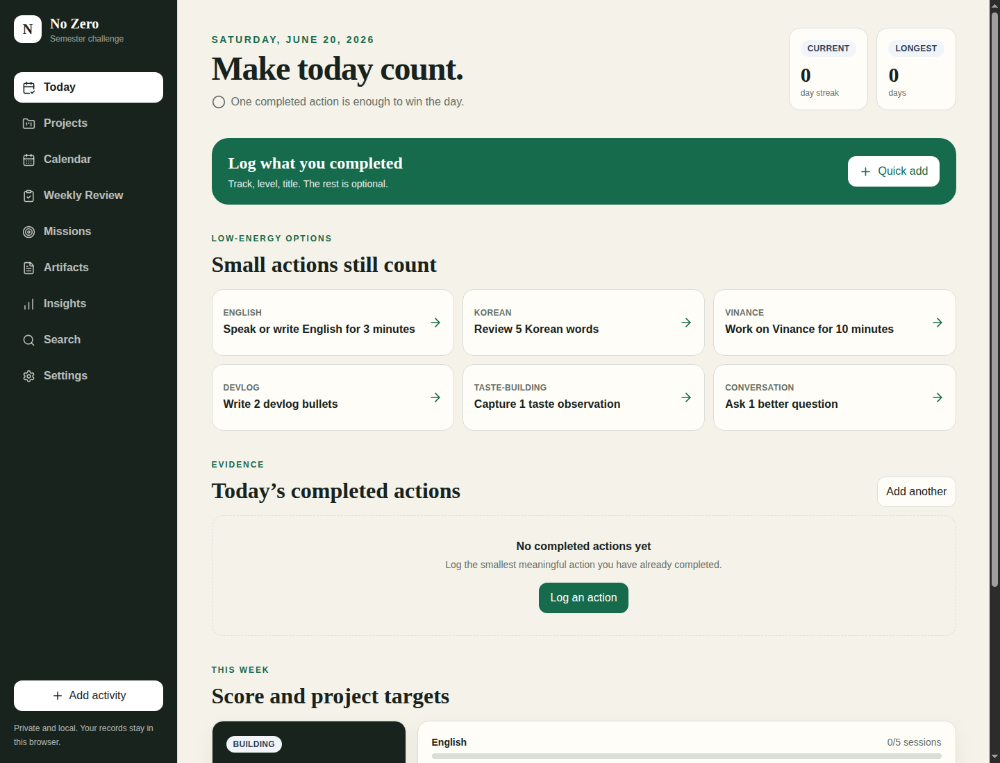

# No Zero

No Zero is a private, local-first semester challenge tracker for keeping momentum across long-running personal projects. It turns the simple rule "do not have a zero day" into a daily dashboard, project system, artifact journal, review workflow, and offline PWA.



## Why It Exists

No Zero is built for people who are working on several important but easy-to-neglect goals at the same time. Instead of asking for perfect productivity every day, it rewards meaningful evidence: one English rep, one Korean review, one Vinance development session, one devlog bullet, one taste note, one better conversation, or one short reflection.

The app is intentionally local-first. There is no account, backend, subscription, or cloud sync. Your records live in browser IndexedDB and can be exported as JSON or Markdown from Settings.

## Highlights

- Daily no-zero dashboard with current streak, longest streak, and today's completed actions.
- Quick activity logging with minimum, normal, and strong effort levels.
- Project tracks for English, Korean, Vinance, devlogs, taste-building, conversation practice, and optional discipline reflections.
- Weekly score and project target tracking derived from completed activities.
- Calendar history for reviewing activity by date.
- Weekly reviews and monthly missions for turning daily reps into reflection.
- Artifact system for devlogs, taste notes, conversation reflections, English notes, Korean notes, Vinance milestones, weekly reviews, monthly reviews, marathon reflections, and custom records.
- Insights dashboard with consistency, project trends, artifact output, recovery behavior, projections, and year-end review drafting.
- Cross-entity search across stored challenge records.
- Full JSON backup, selected backup export, Markdown export, import preview, merge/replace restore, and reset protection.
- Installable offline PWA with service worker caching and local browser storage.

## Tech Stack

| Area | Tooling |
| --- | --- |
| App | React, TypeScript, Vite |
| Routing | React Router |
| Styling | Tailwind CSS |
| UI primitives | Radix UI, Lucide React |
| Storage | IndexedDB through Dexie |
| Forms and validation | React Hook Form, Zod |
| Dates | date-fns |
| Charts | Recharts |
| PWA | vite-plugin-pwa, Workbox |
| Tests | Vitest, React Testing Library, Playwright, axe-core |

## Getting Started

### Requirements

- Bun 1.3 or newer
- A modern browser with IndexedDB and service worker support
- Playwright Chromium for end-to-end tests

### Install

```bash
bun install
```

### Run Locally

```bash
bun run dev
```

Open the local URL printed by Vite, usually `http://localhost:5173/`.

### Useful Scripts

```bash
bun run lint
bun run typecheck
bun run test
bun run build
bun run test:e2e
```

Install the Playwright browser once when needed:

```bash
bunx playwright install chromium
```

## Project Structure

```text
src/
  app/          application shell, router, providers, bootstrap, errors
  components/   reusable project-owned UI primitives
  db/           Dexie schema, initialization, repositories, transactions
  domain/       durable types, validation, selectors, calculations
  features/     workflow-owned screens, services, hooks, forms
  pwa/          offline state, app reload prompts, dirty-form protection
  seed/         default tracks and monthly missions
  test/         shared test builders and IndexedDB setup

docs/
  PRD.md        product requirements
  SDD.md        software design document
  assets/       README and documentation images
```

The main design rule is that UI components do not access Dexie directly. Feature services and query hooks use repository interfaces, while streaks, scores, targets, insights, and projections are derived from stored activities and artifacts.

## Data Model

No Zero stores durable records in the browser:

- `tracks`: challenge areas, targets, default points, and no-zero eligibility.
- `activities`: completed daily actions, effort level, points, notes, tags, and linked artifacts.
- `artifacts`: longer-form evidence such as devlogs, reviews, taste notes, and milestone records.
- `missions`: monthly challenge checklists and notes.
- `vinanceFeatures` and `vinanceTasks`: product-building records for the Vinance track.
- `settings` and `metadata`: app configuration, challenge dates, locale, timezone, schema version, and seed version.

The IndexedDB database name is `no-zero`.

## Privacy and Backup

No Zero does not send application data to a server. The static host only serves the app bundle. All challenge records remain in the current browser profile unless you export them.

Use Settings to:

- Download a complete JSON backup.
- Export a selected date range or track.
- Export Markdown summaries.
- Preview an import before applying it.
- Merge or replace local data from a backup.
- Reset local data after an automatic safety export.

Clearing browser site data removes the local dataset, so regular backups are recommended.

## Build and Deploy

Create a production build:

```bash
bun run build
```

Preview the generated static bundle:

```bash
bun run preview
```

The build output is written to `dist/`. When deploying under a subpath, set `BASE_PATH`:

```bash
BASE_PATH=/no-zero/ bun run build
```

Your host should serve `index.html` as the fallback for application routes.

## Testing

The project has several test layers:

- Unit and domain tests for calculations, schemas, relationships, selectors, backup behavior, and insight generation.
- Component and form tests for user-facing workflows.
- Playwright end-to-end tests for core tracker, reviews, missions, and accessibility.

Run the full local verification set before publishing changes:

```bash
bun run lint
bun run typecheck
bun run test
bun run build
bun run test:e2e
```

## Roadmap

- Improve import conflict reporting and restoration guidance.
- Expand specialized artifact workflows for the active challenge tracks.
- Add richer insight explanations and progress comparisons.
- Add more end-to-end coverage for search, insights, and backup flows.
- Prepare a hosted demo mode with seeded, non-personal data.

## Contributing

Contributions are welcome once the repository has a declared license and public issue workflow. A good first contribution is one that improves reliability, accessibility, documentation, or a focused daily tracking workflow.

Before opening a pull request:

1. Keep changes scoped to one behavior or documentation area.
2. Add or update tests when changing domain rules, repositories, forms, or route behavior.
3. Run linting, typechecking, tests, and a production build.
4. Avoid introducing a backend dependency unless the architecture is intentionally changed.

## Documentation

- [Product requirements](docs/PRD.md)
- [Software design document](docs/SDD.md)
- [Implementation specs and plans](docs/superpowers)

## License

MIT License. See [LICENSE](LICENSE).
