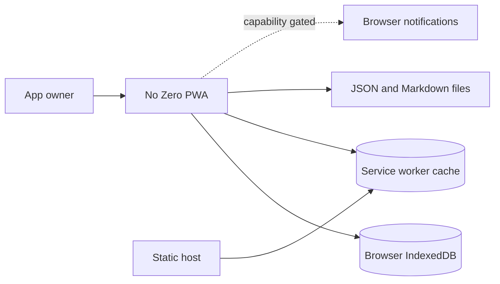
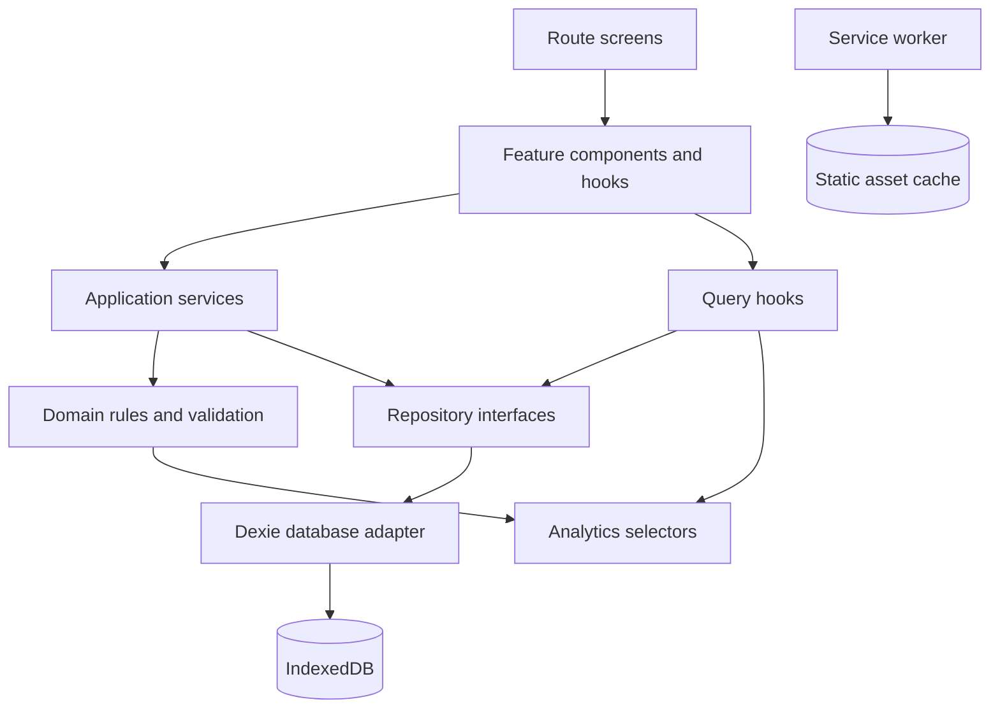
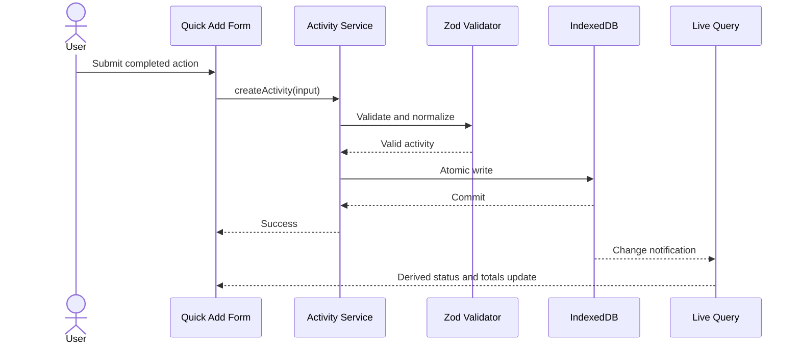

# Software Design Document: No Zero

## 1. Document Control

| Field | Value |
| --- | --- |
| Product | No Zero - Semester Challenge Tracker |
| Document | Software Design Document |
| Status | Implementation baseline |
| Product requirements | `docs/PRD.md` |
| Target period | First use through 31 December 2026 |
| Primary client | Mobile PWA |
| Architecture | Local-first, single-user React application |

### 1.1 Purpose

This document translates the No Zero Product Requirements Document into an
implementable software design. The PRD remains the source of truth for product
intent and user-facing requirements. This SDD defines technical boundaries,
data contracts, algorithms, failure behavior, delivery phases, and verification.

### 1.2 Goals

The implementation must:

1. Make daily activity logging possible in under 30 seconds.
2. Work without a backend or account.
3. Preserve user data across reloads and offline sessions.
4. Derive streaks, scores, targets, and insights consistently from stored data.
5. Support safe schema evolution and backup restoration.
6. Remain usable on mobile, tablet, and desktop.

### 1.3 Non-Goals

- Multi-user accounts, authentication, or authorization.
- Cloud synchronization or server-side backup.
- Social features or public publishing.
- Native mobile applications.
- Full running, GPS, health, or fitness tracking.
- Binary photo, audio, or video storage in the initial product.
- Guaranteed notifications while the PWA is closed.

## 2. Architectural Decisions

### 2.1 Technology Baseline

| Area | Decision |
| --- | --- |
| Application | React with TypeScript |
| Build | Vite |
| Routing | React Router |
| Styling | Tailwind CSS |
| UI primitives | Radix UI |
| Icons | Lucide React |
| Durable storage | IndexedDB through Dexie |
| Runtime validation | Zod |
| Forms | React Hook Form with Zod schemas |
| Dates | date-fns using local calendar dates |
| Charts | Recharts, loaded only on Insights routes |
| PWA | Vite PWA plugin and Workbox |
| Unit/component tests | Vitest and React Testing Library |
| Browser tests | Playwright |
| Accessibility checks | axe-core integration |

Dependencies may be upgraded within compatible major versions. A major-version
upgrade requires migration verification and a successful critical-flow test run.

### 2.2 Core Decisions

1. IndexedDB is the source of truth for durable application data.
2. UI components do not access Dexie directly.
3. Repositories expose storage operations; application services coordinate
   validation, transactions, and relationship updates.
4. Streaks, totals, statuses, projections, and dashboard values are derived and
   are never authoritative stored records.
5. React state contains transient state only, such as forms, open dialogs,
   filters, selected tabs, and pending import previews.
6. Domain calculations are pure TypeScript functions independent of React and
   IndexedDB.
7. Features are organized by user workflow rather than by technical file type.
8. Reviews are artifacts with typed details, not a separate review subsystem.
9. Tracks are archived by default; destructive deletion is restricted.
10. All durable multi-record changes are atomic IndexedDB transactions.

### 2.3 System Context



The static host supplies application assets. After the initial successful load,
the service worker provides the application shell offline. User records remain
in IndexedDB and are not sent to the host.

### 2.4 Container Design



## 3. Application Structure

The codebase should use the following ownership boundaries:

```text
src/
  app/             application shell, router, providers, error boundaries
  db/              Dexie schema, migrations, repositories, transactions
  domain/          shared entities, value objects, calculations, validation
  features/        workflow-oriented feature modules
  components/      reusable project-owned UI primitives
  pwa/             install, update, capability, and reminder integration
  seed/            versioned default records
  test/            shared test builders and IndexedDB setup
```

Each feature may contain its routes, components, hooks, schemas, and feature-only
helpers. Shared domain rules must not import React. The database layer must not
import feature components.

### 3.1 Feature Modules

| Module | Responsibilities |
| --- | --- |
| Today | Daily status, quick add, suggestions, logs, score preview |
| Projects | Track list, track configuration, progress, history |
| Calendar | Month grid, day details, project filtering |
| Reviews | Weekly and monthly review forms and summaries |
| Missions | Monthly mission checklist, progress, and notes |
| Artifacts | Typed artifact creation, editing, linking, filtering |
| Vinance | Features, tasks, development sessions, blockers |
| Search | Cross-entity text search and structured filters |
| Insights | Derived daily, weekly, monthly, and semester analytics |
| Settings | Configuration, storage status, import/export, reset |
| PWA | Install prompt, offline state, updates, reminders |

English, Korean, Devlog, Taste, Conversation, and Marathon workflows are
specialized artifact/activity editors within their relevant feature modules.
They share generic storage records but expose domain-specific forms.

### 3.2 Routes

| Route | Screen |
| --- | --- |
| `/` | Today |
| `/projects` | Project track list |
| `/projects/:trackId` | Project detail and history |
| `/calendar` | Calendar |
| `/reviews/weekly` | Weekly review |
| `/missions` | Monthly missions |
| `/artifacts` | Artifact list |
| `/artifacts/new/:type?` | Artifact editor |
| `/artifacts/:artifactId` | Artifact detail/editor |
| `/vinance` | Vinance feature tracker |
| `/insights` | Insights dashboard |
| `/search` | Search results |
| `/settings` | Settings and data management |

Mobile uses a compact bottom navigation for the highest-frequency destinations
and an overflow menu for secondary destinations. Desktop uses persistent side
navigation. Navigation labels and route access remain equivalent.

## 4. Domain Model

### 4.1 Shared Types

```ts
type EntityId = string;
type LocalDate = string; // YYYY-MM-DD in the configured local time zone
type YearMonth = string; // YYYY-MM
type Instant = string;   // UTC ISO-8601 timestamp

type AuditFields = {
  createdAt: Instant;
  updatedAt: Instant;
};
```

IDs are generated with `crypto.randomUUID()`. Local dates are validated as real
calendar dates. Instants must include a UTC offset and are normalized to UTC.

### 4.2 Track

```ts
type Track = AuditFields & {
  id: EntityId;
  slug: string;
  name: string;
  description: string;
  icon: string;
  color: string;
  status: "active" | "archived";
  sortOrder: number;
  defaultPoints: number;
  weeklyTarget: number;
  minimumAction: string;
  normalAction: string;
  strongAction: string;
  endOfYearGoal?: string;
  countsTowardNoZero: boolean;
};
```

Default tracks use stable IDs equal to their PRD slugs. Custom tracks use UUIDs.
Names and slugs are unique among non-archived tracks.

### 4.3 Activity

```ts
type ActionLevel = "minimum" | "normal" | "strong";

type Activity = AuditFields & {
  id: EntityId;
  date: LocalDate;
  trackId: EntityId;
  level: ActionLevel;
  title: string;
  note?: string;
  durationMinutes?: number;
  points: number;
  bonusPoints: number;
  tags: string[];
  artifactIds: EntityId[];
  metadata?: Record<string, unknown>;
};
```

`points` is the awarded base value captured at logging time. Later changes to a
track's default do not rewrite history. `bonusPoints` defaults to zero. Total
awarded points are `points + bonusPoints` and cannot be negative.

### 4.4 Artifact

```ts
type ArtifactType =
  | "devlog"
  | "taste_note"
  | "conversation_reflection"
  | "english_note"
  | "korean_note"
  | "vinance_milestone"
  | "weekly_review"
  | "monthly_review"
  | "marathon_reflection"
  | "custom";

type ArtifactStatus =
  | "idea"
  | "drafting"
  | "reviewed"
  | "published"
  | "completed"
  | "archived";

type Artifact = AuditFields & {
  id: EntityId;
  type: ArtifactType;
  title: string;
  date: LocalDate;
  trackId?: EntityId;
  tags: string[];
  status: ArtifactStatus;
  content: string;
  externalLink?: string;
  details: ArtifactDetails;
};
```

`ArtifactDetails` is a discriminated union keyed by `Artifact.type`. It captures
the PRD-specific fields without creating a database table for every workflow.
Examples include English confidence and mistakes, Korean words and enjoyment,
taste judgments, conversation follow-ups, devlog word count, and marathon pace.
Unknown detail keys from a newer schema are preserved during export/import.

### 4.5 Reviews

Weekly reviews use a deterministic period key in their details:

```ts
type WeeklyReviewDetails = {
  kind: "weekly_review";
  weekStart: LocalDate;
  weekEnd: LocalDate;
  wentWell: string;
  skippedOrAvoided: string;
  bestArtifactId?: EntityId;
  weakestTrackId?: EntityId;
  consistencyHelp: string;
  consistencyBlocker: string;
  nextWeekPriority: string;
};
```

Monthly reviews similarly use `month: YearMonth`. Only one active weekly review
per `weekStart` and one active monthly review per month are permitted. Archived
reviews do not participate in this uniqueness rule.

### 4.6 Monthly Mission

```ts
type MissionChecklistItem = {
  id: EntityId;
  label: string;
  completed: boolean;
  completedAt?: Instant;
};

type MonthlyMission = AuditFields & {
  id: EntityId;
  month: YearMonth;
  title: string;
  theme: string;
  description?: string;
  checklist: MissionChecklistItem[];
  targetArtifactIds: EntityId[];
  notes: string;
  reviewArtifactId?: EntityId;
  completed: boolean;
};
```

Mission progress is derived as completed checklist items divided by checklist
items. An empty checklist has zero percent progress unless `completed` is true.

### 4.7 Vinance Records

```ts
type WorkStatus =
  | "idea"
  | "planned"
  | "in_progress"
  | "blocked"
  | "done"
  | "archived";

type VinanceFeature = AuditFields & {
  id: EntityId;
  name: string;
  description?: string;
  module: string;
  priority: "low" | "medium" | "high" | "critical";
  status: WorkStatus;
  notes?: string;
};

type VinanceTask = AuditFields & {
  id: EntityId;
  featureId: EntityId;
  title: string;
  description?: string;
  status: WorkStatus;
  sortOrder: number;
};
```

Feature completion is derived from non-archived tasks. A feature without tasks
is 100 percent only when its own status is `done`; otherwise it is zero percent.

### 4.8 Settings and Metadata

```ts
type AppSettings = {
  id: "app";
  challengeStartDate: LocalDate;
  challengeEndDate: LocalDate;
  weekStartsOn: "monday" | "sunday";
  locale: string;
  timeZone: string;
  theme: "light" | "dark" | "system";
  weeklyThresholds: {
    minimumWin: number;
    goodWeek: number;
    excellentWeek: number;
  };
  reminders: {
    enabled: boolean;
    dailyTime?: string;
    weeklyReviewDay?: number;
    weeklyReviewTime?: string;
    monthlyReviewTime?: string;
  };
  updatedAt: Instant;
};

type DatabaseMetadata = {
  id: "database";
  schemaVersion: number;
  seedVersion: number;
  initializedAt: Instant;
  lastBackupAt?: Instant;
};
```

On first successful initialization, `challengeStartDate` is set to the user's
current local date. The default `challengeEndDate` is `2026-12-31`.

## 5. Persistence Design

### 5.1 IndexedDB Tables and Indexes

| Table | Primary key and indexes |
| --- | --- |
| `tracks` | `id`, `slug`, `status`, `sortOrder`, `updatedAt` |
| `activities` | `id`, `date`, `trackId`, `[trackId+date]`, `updatedAt`, multi-entry `tags` |
| `artifacts` | `id`, `type`, `date`, `trackId`, `status`, `[type+date]`, `updatedAt`, multi-entry `tags` |
| `missions` | `id`, unique `month`, `updatedAt` |
| `vinanceFeatures` | `id`, `status`, `priority`, `module`, `updatedAt` |
| `vinanceTasks` | `id`, `featureId`, `[featureId+status]`, `updatedAt` |
| `settings` | `id` |
| `metadata` | `id` |

Search uses indexed narrowing first and normalized in-memory text matching over
the resulting candidate set. The expected single-user dataset does not justify
a separate full-text engine. Search inputs are debounced, but writes are not.

### 5.2 Repository Interfaces

Repositories expose typed operations such as:

```ts
interface ActivityRepository {
  get(id: EntityId): Promise<Activity | undefined>;
  listByDateRange(from: LocalDate, to: LocalDate): Promise<Activity[]>;
  listByTrack(trackId: EntityId, range?: DateRange): Promise<Activity[]>;
  put(activity: Activity): Promise<void>;
  delete(id: EntityId): Promise<void>;
}
```

Equivalent repositories exist for each durable aggregate. Query hooks subscribe
to Dexie live queries and return loading, success, empty, and error states.

### 5.3 Transactions and Relationships

- Creating a specialized artifact and its activity link is one transaction.
- Updating links modifies both sides in one transaction.
- Deleting an activity removes its ID from no other authoritative record;
  linked artifacts remain.
- Deleting an artifact removes its ID from all activity and mission links.
- A referenced track cannot be hard-deleted. It must be archived.
- Hard deletion of an unreferenced custom track requires confirmation.
- Deleting a Vinance feature with tasks is blocked until tasks are moved,
  archived, or explicitly deleted in the same confirmed transaction.
- A failed transaction leaves all involved records unchanged.

### 5.4 Schema Migrations

Dexie database versions define sequential migrations. Each migration:

1. validates the prior known shape,
2. adds defaults without deleting unknown values,
3. transforms records within an upgrade transaction,
4. updates metadata only after success,
5. is tested against fixtures for every supported prior schema.

If migration fails, the app enters recovery mode. Recovery mode permits exporting
the raw database diagnostic backup and retrying after reload, but blocks normal
writes to avoid compounding corruption.

## 6. Application Services and Data Flow

### 6.1 Daily Check-In



The form defaults to today's local date, the selected track's default points,
and minimum action when launched from a low-energy suggestion. Successful save
closes the form and announces completion. Failed persistence keeps entered data
visible and presents a retry action.

### 6.2 Specialized Entries

Specialized forms validate their own detail payload, then call an application
service that may create:

1. a typed artifact,
2. an optional activity representing the completed session,
3. reciprocal links between both records.

The user explicitly chooses whether a draft artifact also counts as an activity.
Publishing or completing an artifact does not silently create a second activity.

### 6.3 Import

Import has four stages:

1. Read the selected JSON file without modifying storage.
2. Validate the envelope, migrate supported older schemas in memory, and produce
   a preview with create, update, unchanged, skipped, and conflict counts.
3. On confirmation, generate and download a full pre-import backup.
4. Apply merge or replacement in one database transaction.

Merge matches records by table and ID. For conflicts, the valid record with the
later `updatedAt` wins. Equal timestamps with unequal content are shown as
unresolved and require choosing local or imported data before apply. Replacement
requires a second explicit confirmation and never preserves records absent from
the imported backup.

### 6.4 Export Contract

```ts
type BackupEnvelope = {
  format: "no-zero-backup";
  schemaVersion: number;
  appVersion: string;
  exportedAt: Instant;
  selection: {
    mode: "full" | "date_range" | "track";
    from?: LocalDate;
    to?: LocalDate;
    trackId?: EntityId;
  };
  data: {
    tracks: Track[];
    activities: Activity[];
    artifacts: Artifact[];
    missions: MonthlyMission[];
    vinanceFeatures: VinanceFeature[];
    vinanceTasks: VinanceTask[];
    settings: AppSettings;
  };
};
```

Selected exports include referenced tracks and linked records needed to interpret
the selection. Markdown exports are human-readable reports and are not accepted
as restorable backups.

## 7. Domain Algorithms

### 7.1 No-Zero Qualification

An activity qualifies when:

- its date is within the inclusive challenge range,
- its referenced track exists,
- the track's `countsTowardNoZero` value is true,
- the activity passes current schema validation.

One or more qualifying activities makes the date active. Points, duration, and
action level do not change qualification.

### 7.2 Current Streak

1. Determine the evaluation date as today, clamped to the challenge range.
2. If today is active, count consecutive active dates backward from today.
3. If today is not active, count backward from yesterday so the current streak
   remains visible until the day ends.
4. Dates before `challengeStartDate` and after `challengeEndDate` are ignored.

The longest streak scans all active dates in range and finds the largest run of
consecutive local calendar dates. Editing or deleting an activity recalculates
both values.

### 7.3 Weekly Boundaries and Status

Weeks use the configured `weekStartsOn` and contain seven local calendar dates.
Weekly points are the sum of activity base and bonus points. Status is:

| Condition | Status |
| --- | --- |
| `< minimumWin` | Failed week |
| `>= minimumWin` and `< goodWeek` | Minimum win |
| `>= goodWeek` and `< excellentWeek` | Good week |
| `>= excellentWeek` | Excellent week |

Threshold validation requires
`0 <= minimumWin < goodWeek < excellentWeek`.

Weekly target progress counts activities, not artifacts or points. Each activity
counts as one session for its track. Archived tracks remain visible in historical
weeks but are omitted from current missing-target prompts.

### 7.4 Monthly and Semester Analytics

- Active days are distinct qualifying activity dates.
- Completion rate is active in-range elapsed days divided by elapsed challenge
  days, excluding future dates.
- Project totals group activities by `trackId`.
- Artifact totals exclude archived artifacts unless explicitly requested.
- Best day of week uses active-day count, then points as a tie-breaker.
- Most productive time is shown only when enough activities contain captured
  time metadata; otherwise the insight is unavailable.
- End-of-year projections use the trailing four complete weeks and are labeled
  estimates. Fewer than two complete weeks suppresses projection.
- Weakest and most consistent tracks compare target completion ratios and omit
  archived or zero-target tracks.

## 8. User Interface Design

### 8.1 Application Shell

The app shell provides:

- responsive navigation,
- route-level error boundary,
- offline and update status,
- global add-activity command,
- toast and accessible live-region announcements,
- theme and reduced-motion handling.

Desktop content uses a restrained work-focused layout. Mobile prioritizes Today,
quick add, and one-handed navigation. Individual records may use cards; entire
page sections must remain unframed.

### 8.2 Today Screen

Order of content:

1. date, current status, and streak,
2. quick-add activity control,
3. minimum-action suggestions,
4. today's completed activities,
5. weekly score and target gaps.

Quick add initially requests only track, action level, and title. Duration,
notes, points, tags, date, and artifact linking are progressive fields. Keyboard
and touch submission must both be supported.

### 8.3 Forms and Validation

- Validation occurs on blur and submit, with field-level messages.
- Required fields use visible labels, not placeholder-only labels.
- Destructive actions use focused confirmation dialogs.
- Unsaved forms warn before route dismissal.
- Date input defaults use the configured time zone.
- Tag entry normalizes surrounding whitespace and compares case-insensitively.
- External links accept only `http` and `https`.

### 8.4 Accessibility

The target is WCAG 2.2 AA for supported workflows. All controls must be keyboard
operable. Dialogs trap and restore focus. Color never communicates status alone.
Charts include textual summaries and do not replace tabular values. Motion obeys
`prefers-reduced-motion`.

## 9. PWA and Offline Design

### 9.1 Caching

The service worker precaches versioned build assets and the application shell.
Navigation requests use an app-shell fallback. User-generated data is never put
in Cache Storage. External links and resources are not required offline.

### 9.2 Updates

New service workers install in the background. When ready, the app displays a
refresh prompt. It does not force-refresh while a form is dirty. After approval,
the app activates the worker, reloads, then runs database migrations before
allowing writes.

### 9.3 Notifications and Reminders

Notifications are best-effort and capability-gated:

- permission is requested only after an explicit user action,
- denied permission does not block reminder settings,
- in-app due and overdue prompts are always available,
- open-app timers may show browser notifications,
- closed-app delivery is not guaranteed without a push backend,
- unsupported browsers show a capability explanation rather than an error.

### 9.4 Installability

The manifest defines the app name, short name, theme colors, standalone display,
start URL, and maskable icons. The app provides install guidance only when the
browser exposes a supported install path.

## 10. Error Handling and Recovery

| Failure | Required behavior |
| --- | --- |
| Validation error | Keep input, identify fields, do not write |
| Storage quota exceeded | Abort transaction, show export/cleanup guidance |
| IndexedDB unavailable | Show blocking compatibility state and export options if readable |
| Transaction failure | Show retry; never report success |
| Migration failure | Enter read-only recovery mode |
| Invalid import | Show validation summary; leave database unchanged |
| Unsupported notification | Disable system delivery and retain in-app reminders |
| Service worker failure | Continue online as a normal SPA and report offline unavailability |
| Route render failure | Isolate with error boundary and preserve durable data |

Reset operations require typing a confirmation phrase. Before a full reset, the
app offers and strongly recommends a backup export. Reset does not clear browser
files already downloaded by the user.

## 11. Security and Privacy

- No application data is transmitted by default.
- No third-party analytics, advertising, or error tracking is included.
- Rendered user content is escaped; Markdown preview must sanitize output.
- Imported data is treated as untrusted and schema-validated.
- External links use `rel="noreferrer noopener"` when opened in a new context.
- Content Security Policy should restrict scripts and connections to the static
  application's own origin unless deployment requires documented additions.
- Sensitive personal content remains subject to browser profile and device
  security; the application does not claim encryption at rest.

## 12. Performance Targets

Measured on a representative mid-range mobile device:

| Operation | Target |
| --- | --- |
| Cached app shell load | Interactive within 2 seconds |
| Open quick-add form | Within 100 ms |
| Commit activity and update Today | Within 300 ms for expected dataset |
| Calendar month calculation | Within 100 ms after records load |
| Typical search result update | Within 250 ms after debounce |
| Insights route | Loaded on demand; no impact on initial route bundle |

Lists over 200 visible records use pagination or virtualization. Analytics queries
must request bounded date ranges and use indexes before in-memory aggregation.

## 13. Testing Strategy

### 13.1 Unit Tests

Cover:

- local-date parsing and date-range clamping,
- week boundaries for Monday and Sunday starts,
- current and longest streak behavior,
- score thresholds and target progress,
- mission and Vinance completion,
- artifact detail schemas,
- projection suppression and calculation,
- import conflict resolution,
- every database migration.

Boundary fixtures include leap days, month/year transitions, daylight-saving
changes in applicable time zones, future challenge starts, and deleted logs.

### 13.2 Repository and Service Tests

Use fake IndexedDB to verify:

- indexed queries,
- atomic multi-record writes,
- relationship cleanup,
- archive and delete restrictions,
- rollback on injected failure,
- seed idempotency,
- merge and replacement imports,
- migration from each supported schema version.

### 13.3 Component Tests

Test:

- quick add with defaults and expanded fields,
- edit/delete recalculation,
- low-energy suggestion flow,
- weekly and monthly review forms,
- typed artifact editors,
- import preview and conflict selection,
- reset and destructive confirmations,
- loading, empty, offline, and error states.

### 13.4 End-to-End Tests

Playwright critical paths:

1. initialize app and verify seeded tracks/missions,
2. add a minimum activity and observe non-zero status,
3. edit its date/points and observe recalculation,
4. create and link a typed artifact,
5. complete a weekly review,
6. export, mutate data, and restore the backup,
7. reload offline and create/edit records,
8. accept a service-worker update without losing a dirty form,
9. navigate and operate core flows by keyboard,
10. verify mobile and desktop layouts without overlap.

Automated axe checks run on all primary routes. Manual checks cover screen-reader
announcements, install behavior, notification capabilities, and browser-specific
PWA limitations.

## 14. Delivery Plan

### Phase 1 - Core Tracker

- Establish application shell, routing, design primitives, database, seed data,
  settings, Today, Projects, activity CRUD, points, streaks, and weekly preview.
- Include full JSON export early to reduce local-data risk.
- Exit criteria: daily action can be logged offline and restored after reload;
  all Phase 1 calculations pass automated tests.

### Phase 2 - Reviews and Missions

- Add weekly reviews, targets, monthly missions, calendar, and generic artifacts.
- Exit criteria: a complete week and month can be reviewed without another tool.

### Phase 3 - Specialized Workflows

- Add English, Korean, Vinance, Devlog, Taste, Conversation, and Marathon forms.
- Add Vinance features/tasks and cross-record links.
- Exit criteria: every default track can capture its PRD-specific data.

### Phase 4 - Data Safety and PWA

- Complete import/merge, selective and Markdown exports, PWA install, update UX,
  settings, storage reporting, reset, and best-effort reminders.
- Exit criteria: backup round-trip and offline critical flows pass in supported
  browsers.

### Phase 5 - Insights and Year-End Review

- Add search, analytics, trends, projections, semester summaries, and year-end
  review generation.
- Exit criteria: all PRD success metrics can be calculated or authored from
  locally stored records.

Each phase must preserve backward-compatible stored data or include a tested
migration. Features may be hidden until complete, but partially written records
must not be introduced into production storage.

## 15. Requirements Traceability

| PRD area | Technical realization | Primary verification |
| --- | --- | --- |
| Daily check-in | Activity service, Today quick add, transaction | Component and E2E |
| Project tracks | Track repository and project routes | Repository and E2E |
| Streaks | Pure local-date selectors | Unit tests |
| Points and targets | Historical activity values and weekly selectors | Unit tests |
| Reviews | Typed review artifacts | Component and E2E |
| Monthly missions | Mission records and derived progress | Unit and component |
| Specialized modules | Typed artifact details and editors | Schema and component |
| Vinance tracking | Feature/task tables and activity links | Repository and E2E |
| Calendar | Indexed date-range query and month projection | Unit and E2E |
| Search and tags | Indexed narrowing plus normalized matching | Unit and component |
| Insights | Derived selectors over bounded queries | Unit and route tests |
| Export/import | Versioned envelope, preview, transactional apply | Repository and E2E |
| Offline/PWA | Service worker shell plus IndexedDB | Playwright offline |
| Notifications | Capability adapter and in-app fallback | Component/manual |
| Settings | Singleton settings record | Repository/component |
| End-of-year review | Derived summary and review artifact | Unit and E2E |

## 16. Definition of Technical Completion

The implementation is technically complete when:

1. all PRD definition-of-done workflows are implemented,
2. durable records conform to the current schemas,
3. migrations and backup restoration pass supported-version fixtures,
4. critical workflows pass offline in the production build,
5. primary routes pass automated accessibility checks,
6. no derived analytics are stored as authoritative data,
7. data remains local unless the user initiates an export,
8. unsupported browser capabilities degrade without blocking core tracking,
9. performance targets are met for the expected single-user dataset,
10. the production static bundle can be deployed under a configurable base path.

## 17. Assumptions

- The app has one owner and one browser-local dataset per browser profile.
- The browser supports modern JavaScript, IndexedDB, and service workers for the
  full PWA experience.
- Initial challenge timing begins on first successful app initialization.
- The initial default end date remains 31 December 2026 but is configurable.
- Local date semantics use the configured IANA time zone captured at setup.
- Text and external links are sufficient for media references in this product.
- Static hosting provider selection does not change domain or persistence rules.
- The PRD remains unchanged and authoritative for product intent.
